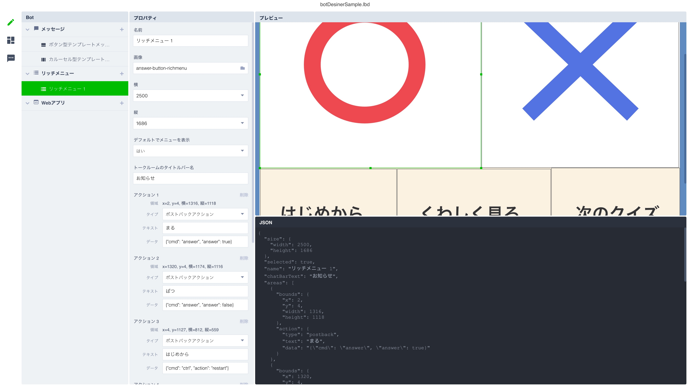

# What is this?

LINEボットのリッチメニューを簡単に作成するためのスクリプトです。
- [リッチメニューについて](http://manual-at.line.me/archives/1067959676.html)
- [APIリファレンス](https://developers.line.biz/ja/reference/messaging-api/#anchor-cc196575bc7029df5565b1edc177c02d0f39606a)

# Usage 

## 1. Bot DesignerでリッチメニューのJSONを生成する。

### [Bot Desiner](https://developers.line.biz/ja/services/bot-designer/)

スクリーンショット


画像を選択し、その上に領域を作っていきます。
領域には`アクション`を設定します。<br>
領域がタップされた時に、その領域に設定したアクションが実行されます。
[アクションについて](https://developers.line.biz/ja/reference/messaging-api/#anchor-9f998a990ea665f62325797de3a58e17d0ea79c8)

領域を作っていくと、画面右下の`JSON`の中身が更新されていきます。
create-richmenu.sh#38行目の-d オプションに、JSONを貼り付けてください。

line-bot-sandbox/typescript/bot/botDesignerSample.lbdを参考にしてください。

## 2. リッチメニューの背景画像を作成する。

背景画像の要件は以下です。

- 画像フォーマット：JPEGまたはPNG
- 画像サイズ：2500×1686または2500×843ピクセル
- 最大ファイルサイズ：1MB

## 3. ボットのアクセストークン、ユーザーIDを取得する。

いずれもチャネル基本設定画面より取得できます。<br>
注) ユーザーIDは、基本設定画面の最下部にある`Your user ID`です。

## 4. スクリプトを実行する。

create-richmenu.shを実行します。
以下の3つのオプションにそれぞれ値を設定してください。

`-a` アクセストークン<br>
`-u` ユーザーID<br>
`-i` リッチメニューの背景画像へのパス（スクリプト実行ディレクトリからの相対パス）<br>

例:

```sh
./bot/create-richmenu.sh -a {アクセストークン} -u {ユーザーID} -i /path/to/image.jpg
```
