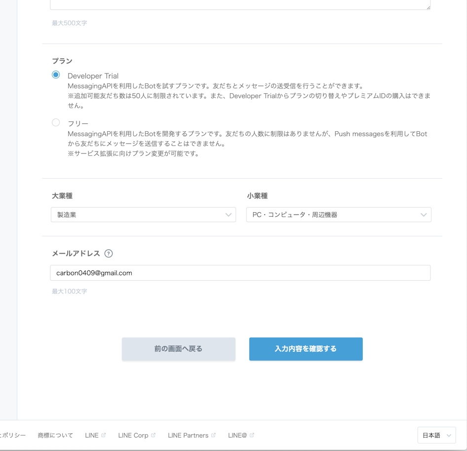
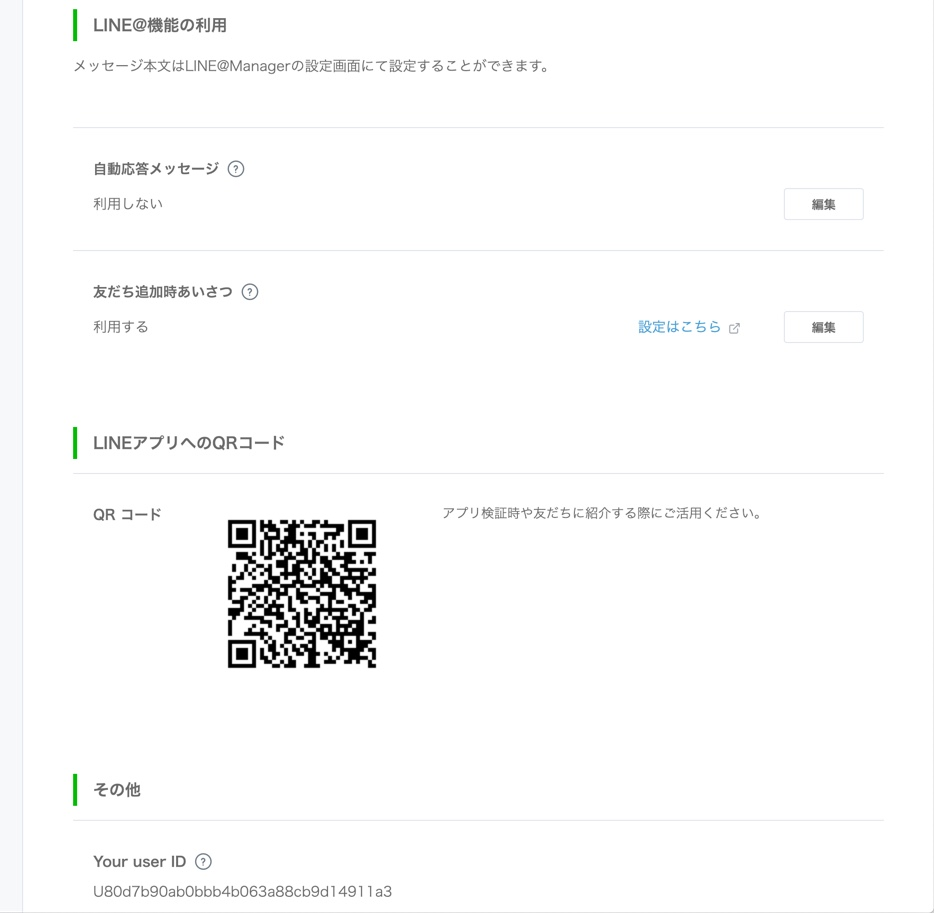

# セットアップ方法（on Heroku）

## 必要なもの
- git
- LINEアカウント
- [Herokuアカウント](https://jp.heroku.com/)
- [Heroku CLI](https://devcenter.heroku.com/articles/heroku-cli#download-and-install)

## 1. Herokuでアプリを作成する。

1-1. [Heroku](https://jp.heroku.com/)へログインする。

1-2. [ダッシュボード](https://dashboard.heroku.com/apps)より、`Create new app`を選択する。


1-3. アプリ名を入力し、アプリを作成する。


1-4. アプリの設定にある`Domain`を記録しておく。（2-6で使用する）


## 2. LINE Botのチャネルを作成する。

2-1. [LINE Developers](https://developers.line.biz/ja/)へログインする。

2-2. [プロバイダーリスト](https://developers.line.biz/console/)より、`新規プロバイダー作成`を押下する。

2-3. 次の画面でプロバイダー名を入力し、プロバイダーを作成する。

2-4. プロバイダーを作成できたら、チャネルを作成する。


2-5. チャネルの情報を入力し、チャネルを作成する。
#### ！プランを「Developer Trial」にすること！


2-6. チャネルを作成できたら、チャネルの設定を変更する。

変更箇所
- アクセストークン: 再発行（`執行までの時間`は0時間後でOK）
- Webhook送信: 利用する
- Webhook URL: 1-4で設定されたDomain + `/webhook`を入力する。（先頭の`https://`は削除する。）
- 自動応答メッセージ: 利用しない




2-7. チャネルの「アクセストークン」と「Channel Secret」は記録しておく。（3-1で使用する）

2-8. チャネルができたので、設定画面下部のQRコードをLINEアプリで読み込み友達に追加する。

## 3. アプリをデプロイする。

##### ソースコードをHerokuにあげることはできないので（コンプライアンスの観点から）、一時的にフォルダを作ってそこにソースコードをコピーします。

``` sh
# 一時的なフォルダを作成し、ソースコードをコピー
cd /repo/root
mkdir /path/to/temporary/folder
cp -R ./typescript/ /path/to/temporary/folder

# Herokuへログイン
$ heroku login

# 2-7. で取得したアクセストークン、Channel Secretを環境変数に追加
$ heroku config:set LINE_CHANNEL_ACCESS_TOKEN={アクセストークン} --app {Herokuのアプリ名(1-3. で設定したもの)}
$ heroku config:set LINE_CHANNEL_SECRET={Channel Secret} --app {Herokuのアプリ名} 

# ビルドパックを追加 
$ heroku buildpacks:add heroku/nodejs --app {Herokuのアプリ名}
$ heroku config:set NPM_CONFIG_PRODUCTION=false --app {Herokuのアプリ名}

# gitリポジトリとして登録・デプロイ
$ git init
$ heroku git:remote -a {Herokuのアプリ名} 
$ git push heroku master
```

## 4. 動作確認

Herokuのアプリが吐くログは、以下のコマンドで参照できます。

```sh
$ heroku logs --tail --app {Herokuのアプリ名}
```
